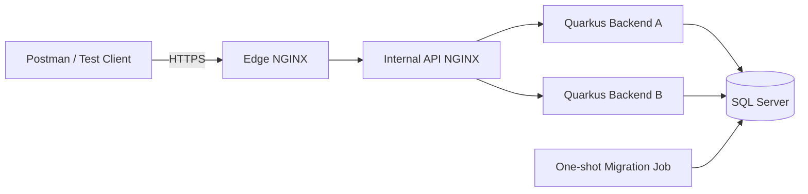
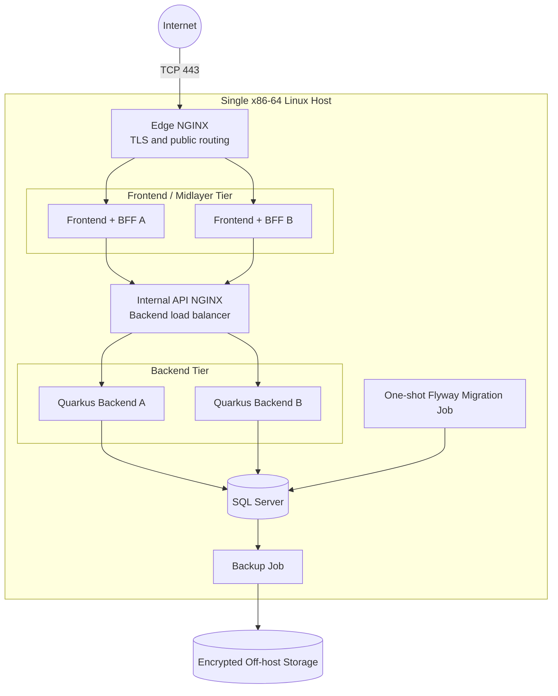
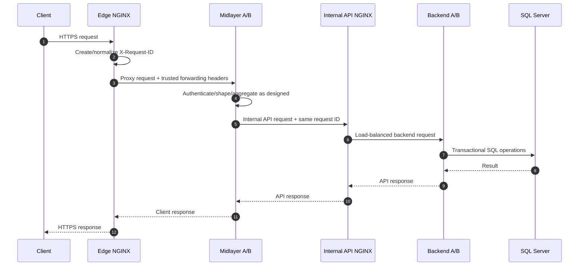

# Single-Host Layered Container Architecture

## Private Instant Messaging Platform Deployment and CI/CD Design

**Document version:** 1.0  
**Status:** Proposed target architecture  
**Last reviewed:** 2026-07-05  
**Repository:** `pHantompX3/ChatBackend`  
**Current branch baseline:** `init`  
**Primary deployment model:** One remotely accessible x86-64 Linux host running Docker Compose  
**Architecture purpose:** Production-oriented technical learning environment, not performance-driven scaling

---

## 1. Purpose

This document defines the planned deployment architecture for the private instant messaging platform represented by the `ChatBackend` repository.

The architecture intentionally introduces multiple application instances and two NGINX proxy layers on a single physical host. The duplicate instances are not required by the expected load. They exist primarily to provide practical experience with:

- containerized application deployment;
- network segmentation;
- reverse proxying;
- layered load balancing;
- horizontal application design;
- stateless services;
- shared database concurrency;
- health and readiness checks;
- graceful shutdown;
- rolling and blue/green deployment patterns;
- schema migration sequencing;
- centralized logging and request correlation;
- failure simulation;
- cloud-agnostic CI/CD;
- backup, recovery, and operational discipline.

The expected production usage is small, approximately five to ten concurrent users. The proposed topology therefore optimizes for learning value, operational clarity, portability, and production-grade engineering practices rather than raw throughput.

This document is intended to be stored at:

```text
docs/architecture/single-host-layered-container-architecture.md
```

---

## 2. Relationship to the Current Repository

The current repository baseline contains:

- Java 25;
- Quarkus 3.33.2.1;
- Maven Wrapper builds;
- Microsoft SQL Server 2022;
- Quarkus Agroal and the Microsoft SQL Server JDBC driver;
- Flyway migrations;
- Quarkus SmallRye Health;
- local SQL Server bootstrap and migration scripts;
- CI workflows that validate database bootstrap and migration behavior.

The current implementation scope is primarily:

1. backend HTTP APIs;
2. database design and repository implementations;
3. database bootstrap and migration automation;
4. test and health infrastructure.

The following components are future scope and are intentionally abstracted in this document:

- browser frontend;
- mobile applications;
- Node.js frontend/midlayer or backend-for-frontend, abbreviated as BFF;
- real-time WebSocket delivery;
- shared cross-instance event distribution.

The target deployment architecture includes those future components so that present backend decisions do not prevent later horizontal deployment.

---

## 3. Architectural Decision Summary

The target production architecture shall use:

- one physical x86-64 Linux device;
- Docker Engine and Docker Compose;
- one publicly exposed edge NGINX instance;
- two frontend/midlayer instances;
- one internal API NGINX instance;
- two Quarkus backend instances;
- one Microsoft SQL Server instance;
- one one-shot database migration job;
- persistent SQL Server storage;
- off-host backups;
- externally executed CI builds;
- OCI-compatible container images;
- registry-based image distribution;
- SSH-triggered or pull-based deployment;
- repository-owned build and deployment scripts.

The complete request path will be:

```text
Client
  -> Edge NGINX
  -> Frontend/Midlayer instance A or B
  -> Internal API NGINX
  -> Quarkus backend instance A or B
  -> Shared SQL Server instance
```

Only the edge NGINX instance shall expose public application ports.

The database shall not be load balanced. Both backend instances shall use the same SQL Server database and the same logical application schema.

---

## 4. Architectural Goals

### 4.1 Primary goals

The architecture shall:

1. remain deployable to one modest remote device;
2. remain independent of any specific cloud provider;
3. support a backend-only implementation phase;
4. support a future frontend and Node.js BFF tier without redesigning the backend deployment model;
5. demonstrate multiple stateless application instances;
6. demonstrate two independent reverse-proxy and load-balancing layers;
7. isolate the public, application, backend, and database network zones;
8. use one shared relational database as the durable source of truth;
9. support controlled database migrations before application rollout;
10. support repeatable deployment and rollback procedures;
11. make request routing and instance selection observable;
12. keep secrets and database ports inaccessible from the public internet;
13. provide recoverable persistent storage and off-host backups;
14. provide a clear future path to multiple physical hosts without requiring Kubernetes.

### 4.2 Learning goals

The architecture should make the following behaviors directly testable:

- requests alternating between frontend/midlayer replicas;
- requests alternating between backend replicas;
- one application replica becoming unavailable;
- one replica becoming unready while remaining alive;
- application startup while the database is unavailable;
- duplicate request handling across different replicas;
- database constraints under concurrent access;
- database connection-pool multiplication;
- scheduled-job duplication;
- WebSocket affinity and cross-instance delivery constraints;
- NGINX configuration reloads;
- version-skew between replicas;
- backward-compatible database migrations;
- staged deployment and rollback.

### 4.3 Explicit non-goals

This architecture does not initially provide:

- true high availability;
- protection from physical host failure;
- protection from host-level network failure;
- database failover;
- redundant storage;
- redundant NGINX hosts;
- multi-region operation;
- automatic physical-node rescheduling;
- Kubernetes orchestration;
- database sharding;
- active-active SQL Server replication;
- guaranteed zero-downtime database schema rollback.

Multiple containers on one host improve process-level resilience and learning value. They do not remove the single physical failure domain.

---

## 5. Architecture Drivers and Constraints

### 5.1 Expected load

The expected user population is small, with approximately five to ten concurrent users. Consequently:

- two frontend/midlayer instances are not required for throughput;
- two backend instances are not required for throughput;
- one SQL Server instance is sufficient;
- a single modern mini PC can provide substantial capacity headroom;
- operational simplicity remains more valuable than distributed infrastructure complexity.

### 5.2 Database constraint

The platform currently targets Microsoft SQL Server. Official SQL Server Linux container images require an Intel or AMD x86-64 host. ARM emulation and translation environments are not supported deployment targets.

This requirement excludes a Raspberry Pi from hosting the complete supported stack while SQL Server remains the database.

### 5.3 Single-device constraint

All runtime containers shall initially execute on one physical machine. Docker networks will simulate tier boundaries that could later map to separate hosts or network segments.

### 5.4 Cloud-agnostic constraint

The build and deployment process shall not require a proprietary cloud runtime. The portable deployment contract shall consist of:

- OCI container images;
- Docker Compose files;
- environment files or mounted secret files;
- POSIX shell scripts;
- SSH;
- standard HTTP health checks;
- an OCI-compatible container registry.

A CI provider may orchestrate these tools, but core deployment behavior shall remain in repository-owned scripts.

### 5.5 Production-oriented learning constraint

The architecture may include deliberate redundancy that is unnecessary for the expected workload. Every redundant component must still have a clearly defined responsibility and must not weaken security or data consistency.

---

## 6. Deployment Topologies

## 6.1 Current backend-focused phase

During the backend and database implementation phase, the frontend/midlayer tier may be omitted.

A useful backend-only rehearsal topology is:



This allows the backend tier, proxy chain, network segmentation, shared database, health checks, and deployment automation to be developed before the Node.js and client layers exist.

The direct edge-to-internal-proxy route is transitional. It shall not be interpreted as the final client-facing application architecture.

## 6.2 Full target topology



## 6.3 Failure-domain interpretation

The topology contains several logical tiers but only one physical failure domain.

| Failure | Expected result |
|---|---|
| Frontend/midlayer A crashes | Edge NGINX can route new requests to frontend/midlayer B |
| Backend A crashes | Internal API NGINX can route new requests to backend B |
| Internal API NGINX crashes | All backend access through the midlayer fails |
| Edge NGINX crashes | All public access fails |
| SQL Server crashes | Durable application operations fail; backend readiness should report `DOWN` |
| Docker daemon fails | All containers fail |
| Physical host fails | Entire platform is unavailable |
| Host SSD fails | Entire platform is unavailable and local data may be lost |
| Router or ISP fails | Remote access fails |
| Power fails without UPS | Entire platform stops abruptly |

The duplicate application instances therefore provide application-process resilience, deployment flexibility, and technical learning—not complete service availability.

---

## 7. Component Responsibilities

## 7.1 Edge NGINX

The edge NGINX instance is the only public application ingress.

### Responsibilities

- listen on public ports `80` and `443`;
- redirect HTTP to HTTPS;
- terminate TLS;
- present the public domain certificate;
- generate or normalize a request correlation identifier;
- overwrite untrusted forwarding headers from external clients;
- apply public request-size limits;
- apply request-rate or connection limits where appropriate;
- apply security headers for web responses;
- proxy WebSocket upgrade requests;
- load balance across frontend/midlayer A and B;
- optionally route limited operational endpoints from trusted networks;
- emit structured access logs.

### Prohibited responsibilities

The edge NGINX instance shall not:

- connect to SQL Server;
- contain database credentials;
- directly execute application business logic;
- expose backend management endpoints publicly;
- expose SQL Server port `1433`;
- trust externally supplied `X-Forwarded-*` headers without normalization.

### Public ports

```text
80/tcp   Optional; redirect or ACME certificate challenge only
443/tcp  Required; HTTPS and secure WebSocket ingress
```

## 7.2 Frontend/midlayer A and B

These are future Node.js-based instances. The exact frontend framework and BFF implementation are intentionally outside the current backend implementation scope.

### Potential responsibilities

- serve the compiled web frontend;
- provide a backend-for-frontend API optimized for web and mobile clients;
- perform client-specific response shaping;
- aggregate backend API calls where justified;
- own browser-specific session or CSRF behavior if the selected authentication model requires it;
- forward authenticated requests to the internal API NGINX service;
- add an instance identifier to logs and diagnostic responses;
- remain stateless or use shared durable state.

### Required scaling properties

Both instances shall:

- run from the same immutable image version during normal operation;
- avoid authoritative in-memory session state;
- avoid durable local filesystem state;
- accept any valid request independently;
- use the internal NGINX service name rather than backend container addresses;
- preserve the edge-generated request identifier;
- provide liveness and readiness endpoints.

## 7.3 Internal API NGINX

The internal API NGINX instance forms the boundary between the frontend/midlayer tier and the Quarkus backend tier.

### Responsibilities

- listen only on an internal Docker network;
- accept traffic only from the frontend/midlayer network;
- load balance across backend A and B;
- preserve the original request identifier;
- append trusted proxy-chain information;
- enforce backend connection and response timeouts;
- control safe retry behavior;
- proxy WebSocket upgrades if backend WebSockets pass through this tier;
- emit structured internal access logs;
- provide a stable backend service address to both frontend/midlayer instances.

### Prohibited responsibilities

The internal API NGINX instance shall not:

- publish a public host port;
- terminate the public TLS connection unless internal TLS is deliberately added later;
- connect to SQL Server;
- expose backend health or management endpoints to the public internet;
- retry unsafe non-idempotent requests without explicit idempotency guarantees.

## 7.4 Quarkus backend A and B

The two Quarkus containers are identical instances of the modular-monolith backend.

### Responsibilities

- expose versioned backend APIs;
- enforce authentication and authorization;
- execute domain and application use cases;
- manage transaction boundaries;
- connect to the shared SQL Server database;
- provide liveness, readiness, startup, and aggregate health endpoints;
- emit structured logs and telemetry;
- support graceful shutdown;
- expose an instance identifier and build metadata for diagnostics;
- remain safe under concurrent requests arriving through different instances.

### Required runtime properties

Containerized Quarkus instances shall bind to:

```properties
quarkus.http.host=0.0.0.0
```

The current local setting of `127.0.0.1` is correct for workstation-only access but would prevent other containers from reaching the backend.

The containerized JDBC URL shall use the Compose service name:

```text
jdbc:sqlserver://sqlserver:1433;databaseName=wl_chat;encrypt=true;trustServerCertificate=false
```

Production shall not use local development password defaults or `trustServerCertificate=true`.

## 7.5 Database migration job

Database migrations shall execute as a one-shot deployment step, not independently in every backend replica.

### Responsibilities

- wait for SQL Server health;
- authenticate using a dedicated migration principal;
- execute the database bootstrap step when explicitly authorized for a new environment;
- execute Flyway migrations exactly once per deployment attempt;
- fail the deployment if validation or migration fails;
- write migration logs to standard output;
- exit successfully after all required migrations are applied.

### Required behavior

- backend startup migration shall remain disabled in production;
- both backend replicas shall start only after migration success;
- previously applied Flyway scripts shall remain immutable;
- a failed migration shall stop application rollout;
- migration credentials shall not be available to the normal backend runtime containers;
- destructive migration steps shall be separated from application rollout when rollback safety requires it.

## 7.6 SQL Server

SQL Server is the single durable data store for the initial platform.

### Responsibilities

- persist users, invitations, sessions, conversations, membership, messages, read positions, audit data, and related records;
- enforce primary keys, foreign keys, uniqueness, and check constraints;
- enforce concurrency guarantees that cannot safely rely on one application instance;
- support transactions used by application use cases;
- provide native backup and restore capability;
- persist data outside the container writable layer.

### Required deployment properties

- run on an x86-64 host;
- use a pinned, tested image tag rather than an unreviewed floating production tag;
- store `/var/opt/mssql` on persistent storage;
- use a strong bootstrap administrator password;
- use a non-`sa` runtime application principal;
- use a separate migration principal where practical;
- expose port `1433` only inside the database network;
- apply an explicit memory limit;
- produce native SQL Server backups to a mounted backup directory;
- copy backups off the physical host.

## 7.7 Backup job

A backup job may be implemented as a host timer, scheduled container, or dedicated operations script.

### Responsibilities

- initiate a SQL Server-native backup;
- verify successful backup completion;
- checksum or otherwise validate the generated artifact;
- encrypt backup data before or during off-host transfer;
- copy backup artifacts to physically separate storage;
- enforce retention;
- alert on failure;
- support documented restore tests.

A backup located only on the production SSD is not an adequate recovery strategy.

---

## 8. Docker Network Segmentation

## 8.1 Network model

The target Compose project shall define four logical networks:

```text
edge
application
backend
database
```

The intended membership is:

| Service | `edge` | `application` | `backend` | `database` |
|---|:---:|:---:|:---:|:---:|
| Edge NGINX | Yes | No | No | No |
| Frontend/midlayer A | Yes | Yes | No | No |
| Frontend/midlayer B | Yes | Yes | No | No |
| Internal API NGINX | No | Yes | Yes | No |
| Quarkus backend A | No | No | Yes | Yes |
| Quarkus backend B | No | No | Yes | Yes |
| Migration job | No | No | No | Yes |
| SQL Server | No | No | No | Yes |
| Backup job | No | No | No | Yes |

## 8.2 Isolation rules

- Only edge NGINX shall publish public application ports.
- Frontend/midlayer instances shall not join the database network.
- Edge NGINX shall not join the backend or database network.
- Internal API NGINX shall not join the database network.
- SQL Server shall join only the database network.
- Backend instances shall not publish host ports.
- Internal networks should use `internal: true` where doing so does not block required outbound communication.
- Service-to-service communication shall use Compose DNS names, not static container IP addresses.

## 8.3 Port matrix

| Source | Destination | Port | Protocol | Purpose |
|---|---|---:|---|---|
| Internet | Edge NGINX | 443 | HTTPS/WSS | Public application traffic |
| Internet | Edge NGINX | 80 | HTTP | Redirect or certificate challenge |
| Edge NGINX | Frontend/midlayer A/B | 3000 | HTTP/WS | Frontend and BFF traffic |
| Frontend/midlayer A/B | Internal API NGINX | 8080 | HTTP/WS | Internal backend requests |
| Internal API NGINX | Quarkus backend A/B | 8080 | HTTP/WS | Backend API traffic |
| Quarkus backend A/B | SQL Server | 1433 | TDS over TCP | Database access |
| Migration job | SQL Server | 1433 | TDS over TCP | Schema migration |
| Backup job | SQL Server | 1433 or local tool invocation | TDS/SQL | Native backup orchestration |
| Administrator | Host | 22 | SSH | Restricted administration |

Port `1433` shall not be forwarded through the router or published on a public host interface.

---

## 9. Request and Correlation Flow

## 9.1 Standard HTTP request



## 9.2 Request identifier rules

The edge proxy is the trust boundary for request correlation.

Recommended behavior:

1. Accept a client request.
2. Ignore or validate any externally supplied request ID according to a strict format and length.
3. Generate a new identifier when the supplied value is absent or invalid.
4. Forward the identifier as `X-Request-ID`.
5. Preserve the same identifier through both proxy tiers and all application logs.
6. include the identifier in problem responses where safe.
7. record the identifier in audit data for important operations.

Suggested log dimensions:

```text
request_id
trace_id
client_address
edge_instance
midlayer_instance
api_proxy_instance
backend_instance
application_version
commit_sha
http_method
request_path
status_code
duration_ms
user_id, when authenticated and appropriate
```

Sensitive tokens, passwords, cookies, message bodies, and authorization headers shall not be written to general logs.

## 9.3 Forwarded-header trust

The edge proxy shall overwrite client-provided forwarding headers.

The frontend/midlayer shall trust forwarded headers only from the edge network. The backend shall trust forwarded headers only from the internal API proxy network or from explicitly configured trusted proxies.

A malicious public client must not be able to claim an arbitrary source IP or secure transport state by sending its own `X-Forwarded-For` or `X-Forwarded-Proto` header.

---

## 10. Load-Balancing Behavior

## 10.1 Edge tier

The edge NGINX upstream shall contain frontend/midlayer A and B.

Appropriate algorithms include:

- default round-robin for simple routing demonstrations;
- `least_conn` for long-lived or uneven requests;
- `ip_hash` only when deliberately demonstrating affinity.

Sticky sessions should not be used to conceal stateful application design. The preferred outcome is that either frontend/midlayer instance can process any new request.

## 10.2 Backend tier

The internal API NGINX upstream shall contain backend A and B.

Round-robin is the simplest learning baseline. `least_conn` can be used later, particularly when requests may have significantly different durations.

## 10.3 Passive failure detection

NGINX Open Source provides passive upstream failure handling. It observes errors during real requests and can temporarily avoid an upstream based on settings such as:

```nginx
max_fails=3 fail_timeout=10s
```

This shall be supplemented by:

- Docker health checks;
- Quarkus readiness checks;
- frontend/midlayer readiness checks;
- deployment scripts that validate an instance before adding or retaining it in active traffic;
- external uptime monitoring.

Passive failure detection is not a substitute for a deployment readiness gate.

## 10.4 Retry safety

Retries must distinguish idempotent and non-idempotent operations.

Safe default principles:

- GET and HEAD requests may be retried under controlled network-failure conditions.
- POST, PATCH, and DELETE requests shall not be automatically retried across upstreams unless the operation has explicit idempotency protection.
- message-send and invitation-redemption operations should accept an idempotency key or a stable client-generated operation identifier.
- a timeout does not prove that the backend failed to commit a transaction.
- retries must not create duplicate messages, users, invitations, or audit records.

---

## 11. Statelessness and Shared State

## 11.1 Required principle

Any request shall be able to reach either replica in a tier without changing correctness.

## 11.2 Authentication state

Authoritative authentication state shall not exist only in JVM or Node.js process memory.

Acceptable strategies include:

- opaque session tokens whose hashes and revocation state are stored in SQL Server;
- short-lived signed access tokens with appropriate shared verification material and a durable revocation strategy where required;
- a future shared session store if introduced deliberately.

The selected model must support:

- immediate logout behavior as defined by the product;
- disabled-user enforcement;
- consistent authorization across both backend instances;
- secret rotation;
- instance replacement without session loss.

## 11.3 Filesystem state

Backend and midlayer container writable layers shall be treated as disposable.

Do not store the following only inside a replica:

- uploaded attachments;
- user profile images;
- durable WebSocket delivery state;
- database backups;
- generated secrets;
- migration history;
- application configuration that must survive replacement.

If attachment storage is added later, use shared durable storage or an S3-compatible object storage abstraction rather than replica-local files.

## 11.4 Caches

In-memory caches may be used only when:

- stale or divergent values do not violate correctness;
- cache invalidation is understood;
- the database remains authoritative;
- a cache miss is safe;
- one replica restarting does not cause data loss.

Security and authorization decisions should not rely on indefinitely stale local cache entries.

---

## 12. Shared Database Concurrency

Two backend replicas create real concurrency even at very low traffic.

## 12.1 Database-enforced uniqueness

Application checks such as “query first, then insert” are insufficient under concurrent requests.

The database shall enforce uniqueness for concepts such as:

- normalized username;
- invitation token hash;
- session token hash;
- direct-conversation uniqueness if the model requires one direct conversation per user pair;
- client-generated message or operation identifier;
- membership uniqueness;
- message sequence uniqueness within a conversation.

The application shall translate duplicate-key and constraint violations into stable domain or HTTP errors.

## 12.2 Idempotency

Operations vulnerable to retries shall use a durable idempotency mechanism.

Example message-send model:

```text
user_id
conversation_id
client_message_id
server_message_id
sequence_number
created_at
```

A unique constraint on a suitable tuple such as:

```text
(user_id, client_message_id)
```

can allow a retried request to return the previously created result rather than create a duplicate.

## 12.3 Lost-update prevention

Where two requests may update the same record, use one or more of:

- optimistic version columns;
- SQL Server `rowversion` where appropriate;
- update predicates that include the expected version;
- carefully scoped pessimistic locking;
- atomic SQL statements;
- serialized transaction boundaries for narrow critical operations.

## 12.4 Message ordering

Conversation message ordering must be independent of backend instance.

A process-local counter is invalid. The sequence allocation strategy must be transactionally coordinated through SQL Server.

Potential strategies include:

- a `next_message_sequence` value on the conversation row updated under a lock;
- a SQL Server sequence combined with per-conversation ordering rules;
- another database-enforced atomic allocation design.

The final approach shall be documented with its locking, contention, and rollback semantics.

## 12.5 Connection-pool multiplication

Each backend replica owns an independent Agroal pool.

Example:

```text
Backend A maximum pool size: 10
Backend B maximum pool size: 10
Total potential backend connections: 20
```

Future midlayer database access, migration connections, administration tools, and monitoring connections would add to the total.

Pool limits shall be selected at the deployment level, not per instance in isolation. For the expected workload, a maximum of approximately five to ten connections per backend replica is likely sufficient as an initial measured baseline, but final values shall be based on observed behavior.

## 12.6 Scheduled work

Any scheduler embedded in the backend will run once per replica unless controlled.

Every scheduled job must be classified as one of:

1. safe to run independently on each replica;
2. idempotent and safe to run concurrently;
3. singleton work that must use a database-backed lease or lock;
4. work that should be moved to a dedicated worker service.

A second backend instance must not silently cause duplicate expiry processing, cleanup, notifications, or other side effects.

---

## 13. Database Migration Strategy

## 13.1 Migration sequence

A deployment that includes schema changes shall follow this order:

```text
1. Verify SQL Server health
2. Create a fresh backup or recovery checkpoint when required
3. Run Flyway validation
4. Run the one-shot migration job
5. Start or update application replicas
6. Wait for readiness
7. Enable traffic
8. Run smoke tests
9. Retain previous image metadata for rollback
```

## 13.2 Expand-and-contract migrations

Application rollback is only safe when the database remains compatible with the previous application version.

Use an expand-and-contract approach:

### Expand

- add new nullable columns;
- add new tables;
- add new indexes carefully;
- deploy code that can operate with old and new structures;
- backfill data separately if needed.

### Migrate

- move reads and writes to the new representation;
- validate data consistency;
- monitor both versions during the transition.

### Contract

- remove deprecated columns or structures in a later release;
- perform destructive changes only after rollback to the old code is no longer required.

## 13.3 Migration authority

- The normal application runtime principal shall not own schema migration permissions.
- The migration job shall use a dedicated principal with only required DDL and migration permissions.
- SQL Server administrator credentials shall be reserved for initial environment bootstrap and controlled recovery operations.
- Backend containers shall not contain the administrator password.

---

## 14. Real-Time and WebSocket Planning

Real-time communication is future scope, but the deployment design must avoid blocking it.

## 14.1 Proxy requirements

Both NGINX layers must preserve WebSocket upgrade semantics when a WebSocket route traverses both layers.

Typical directives include:

```nginx
proxy_http_version 1.1;
proxy_set_header Upgrade $http_upgrade;
proxy_set_header Connection $connection_upgrade;
```

A `map` should be used to set the `Connection` header correctly rather than always forcing `upgrade` for ordinary HTTP requests.

## 14.2 Connection affinity

A WebSocket remains attached to the selected application instance for the lifetime of that connection. Rebalancing affects new connections, not an established socket.

## 14.3 Cross-instance delivery problem

A future scenario may be:

```text
User A WebSocket -> Backend A
User B WebSocket -> Backend B
```

Backend A cannot deliver directly to a socket held only in Backend B memory.

A future cross-instance event mechanism may therefore be needed, such as:

- Redis Pub/Sub;
- RabbitMQ;
- an AMQP broker;
- Kafka, only if justified;
- SQL Server-backed outbox and polling for the initial low-volume implementation;
- another deliberately selected event distribution system.

The durable database remains the source of truth. A real-time event is a delivery signal, not the only persisted copy of a message.

## 14.4 Reconnection behavior

Clients must tolerate:

- proxy reloads;
- backend replacement;
- host restart;
- temporary network interruption;
- lost transient delivery signals.

On reconnect, the client shall reconcile from durable message history using a cursor, sequence, or last-seen identifier rather than assuming every live event was received.

---

## 15. Health, Readiness, and Startup

## 15.1 Quarkus endpoints

The current backend includes SmallRye Health. The relevant endpoints include:

```text
/q/health/live
/q/health/ready
/q/health/started
/q/health
```

The datasource integration contributes a readiness check when configured with SmallRye Health and Agroal.

## 15.2 Semantic rules

- **Liveness:** the process is functioning and should not be restarted solely because a dependency is unavailable.
- **Readiness:** the instance can safely receive normal traffic.
- **Startup:** initialization has completed.
- **Aggregate health:** combined health status for diagnostics.

A database outage should generally make the backend unready while not automatically declaring the JVM dead.

## 15.3 Public exposure

Operational endpoints shall not be exposed to the public internet by default.

Options include:

- keep them available only on internal Docker networks;
- use the Quarkus management interface on a separate internal port;
- allow restricted access from an administration network;
- have deployment scripts query the container directly through Docker networking.

## 15.4 Container health checks

Container health checks should validate the service itself, not only the existence of a process.

Examples:

- SQL Server: execute `SELECT 1` through `sqlcmd`;
- Quarkus: query `/q/health/ready`;
- Node.js midlayer: query `/health/ready`;
- NGINX: validate the local listener and configuration.

Health checks shall use realistic start periods so slow JVM or SQL Server startup is not mistaken for permanent failure.

---

## 16. Deployment Modes

The two replicas in each application tier support several learning modes.

## 16.1 Permanent active-active replicas

Both instances serve traffic simultaneously.

```text
Edge NGINX -> Midlayer A and B
API NGINX  -> Backend A and B
```

Use this mode to study:

- statelessness;
- routing distribution;
- connection pools;
- shared database concurrency;
- partial-instance failure.

## 16.2 Rolling replacement

Update one instance at a time:

1. remove or disable instance A from active routing;
2. replace A with the new image;
3. validate readiness and smoke tests;
4. return A to routing;
5. repeat for B.

This mode can keep one instance available while another is replaced, provided schema and API compatibility are maintained.

## 16.3 Blue/green deployment

Use one color as active and one as candidate:

```text
Blue  -> current version
Green -> candidate version
```

Deployment sequence:

1. pull the candidate image;
2. start the inactive color;
3. run readiness and smoke checks;
4. switch NGINX upstream configuration;
5. validate externally;
6. keep the old color available for a defined rollback window;
7. retire the old color after confidence is established.

Blue/green deployment provides strong learning value but is not a complete rollback solution when a database migration is destructive.

## 16.4 Weighted or canary routing

Open-source NGINX can approximate controlled routing through configuration choices, but advanced dynamic traffic management may require more manual configuration or additional tooling.

Canary behavior may initially be tested by:

- a separate host name;
- a request header routed through an NGINX `map`;
- a restricted test path;
- explicit upstream configuration.

Do not introduce canary complexity before ordinary repeatable deployments are reliable.

---

## 17. Cloud-Agnostic CI/CD

## 17.1 Core principle

CI/CD provider configuration shall remain a thin orchestration layer. Build, test, migration, deployment, health-check, and rollback logic shall live in version-controlled repository scripts.

Recommended structure:

```text
scripts/
├── ci/
│   ├── verify-toolchain.sh
│   ├── test.sh
│   ├── integration-test.sh
│   ├── build-image.sh
│   └── publish-image.sh
├── deploy/
│   ├── validate-environment.sh
│   ├── migrate.sh
│   ├── deploy-backend.sh
│   ├── deploy-blue-green.sh
│   ├── reload-nginx.sh
│   ├── smoke-test.sh
│   └── rollback.sh
└── operations/
    ├── backup-database.sh
    ├── restore-database.sh
    ├── verify-backup.sh
    └── collect-diagnostics.sh
```

The same scripts should be callable from:

- GitHub Actions;
- GitLab CI;
- Jenkins;
- Buildkite;
- Woodpecker CI;
- a developer workstation;
- another standard Linux runner.

## 17.2 Recommended pipeline

```mermaid
flowchart LR
    Commit[Git Commit] --> CI[External CI Runner]
    CI --> Unit[Compile and Unit Tests]
    Unit --> Integration[SQL Server Integration Tests]
    Integration --> Image[Build OCI Image]
    Image --> Scan[Dependency and Image Scan]
    Scan --> Registry[(OCI Registry)]
    Registry --> Deploy[Remote Deployment Script]
    Deploy --> Migrate[One-shot Migration]
    Migrate --> Rollout[Replica Rollout]
    Rollout --> Verify[Readiness and Smoke Tests]
```



## 17.3 Build output

Application images shall be:

- immutable;
- tagged with a release or commit identifier;
- preferably deployed by digest;
- labeled with source revision and build time;
- built once and promoted between environments;
- free of production secrets.

Suggested metadata:

```text
org.opencontainers.image.title
org.opencontainers.image.version
org.opencontainers.image.revision
org.opencontainers.image.created
org.opencontainers.image.source
```

## 17.4 Registry independence

Any OCI-compatible registry may be used, including:

- GitHub Container Registry;
- GitLab Container Registry;
- Docker Hub;
- Harbor;
- a private standard registry.

Deployment scripts shall accept an image reference as input rather than hard-code a provider-specific registry.

## 17.5 Production host role

The production host should primarily:

- pull approved images;
- run migrations;
- start and stop containers;
- perform local health checks;
- retain deployment metadata;
- run backups and operational checks.

It should not normally compile untrusted source code or execute arbitrary pull-request workflows.

A general-purpose self-hosted CI runner should not run on the same host as production containers. A compromised or unsafe workflow could otherwise obtain access to production files, Docker, networks, or secrets.

## 17.6 Deployment trigger options

### Push-based deployment

The CI system connects over restricted SSH and invokes a stable server-side script:

```bash
ssh deploy@chat-host \
  "/opt/chat-platform/bin/deploy.sh 'registry.example/chat-backend@sha256:...'"
```

Advantages:

- simple;
- immediate;
- easy to understand.

Requirements:

- restricted deploy account;
- SSH keys;
- constrained `sudo` permissions;
- protected CI environment secrets;
- deployment approval gates for production.

### Pull-based deployment

A restricted agent or timer on the host detects an approved release and pulls it.

Advantages:

- production can avoid inbound SSH from CI;
- outbound-only registry access is possible.

Trade-off:

- more local deployment-agent logic;
- release approval and state tracking require deliberate design.

The initial recommendation is a restricted SSH-triggered deployment because it is easier to inspect and learn.

---

## 18. Configuration and Secret Management

## 18.1 Configuration classes

Configuration shall be separated into:

1. non-sensitive defaults stored in the repository;
2. environment-specific non-secret values;
3. secret values stored outside the repository;
4. generated deployment metadata.

## 18.2 Production secret rules

Production shall not use known fallback values such as:

```properties
${WL_CHAT_DB_PASSWORD:known-development-password}
```

A missing production secret must cause startup or deployment validation to fail.

Secrets include:

- SQL Server administrator password;
- application database password;
- migration database password;
- session-token or signing secrets;
- TLS private keys when not automatically managed;
- registry credentials;
- backup encryption keys;
- external service credentials.

## 18.3 Storage options

For an initial single-host deployment, acceptable cloud-agnostic options include:

- root-owned files under `/opt/chat-platform/secrets` with mode `0600`;
- files mounted read-only into containers;
- an external secret manager accessed at deployment or startup time;
- Docker secrets if the selected orchestration mode and threat model justify them.

A Compose `secrets` declaration should not be described as encrypted secret storage by itself. The security of the source secret file and host remains essential.

## 18.4 Environment validation

Before deployment, a script shall verify:

- required variables are present;
- secrets are not obvious development defaults;
- files have restrictive permissions;
- image references are immutable or approved;
- database and application URLs use production values;
- certificate bypass is disabled;
- no forbidden public port bindings exist.

---

## 19. NGINX Configuration Model

## 19.1 Edge upstream example

```nginx
upstream frontend_midlayer {
    least_conn;

    server frontend-midlayer-a:3000 max_fails=3 fail_timeout=10s;
    server frontend-midlayer-b:3000 max_fails=3 fail_timeout=10s;

    keepalive 16;
}
```

## 19.2 Edge server example

```nginx
map $http_upgrade $connection_upgrade {
    default upgrade;
    ''      close;
}

server {
    listen 80;
    server_name chat.example.com;

    return 301 https://$host$request_uri;
}

server {
    listen 443 ssl;
    http2 on;
    server_name chat.example.com;

    ssl_certificate     /etc/nginx/tls/fullchain.pem;
    ssl_certificate_key /etc/nginx/tls/privkey.pem;

    client_max_body_size 2m;

    location / {
        proxy_pass http://frontend_midlayer;
        proxy_http_version 1.1;

        proxy_set_header Host $host;
        proxy_set_header X-Request-ID $request_id;
        proxy_set_header X-Real-IP $remote_addr;
        proxy_set_header X-Forwarded-For $remote_addr;
        proxy_set_header X-Forwarded-Proto https;

        proxy_set_header Upgrade $http_upgrade;
        proxy_set_header Connection $connection_upgrade;

        proxy_connect_timeout 5s;
        proxy_send_timeout 30s;
        proxy_read_timeout 60s;
    }

    location ^~ /q/ {
        return 404;
    }
}
```

The exact TLS configuration shall follow the current operating-system and NGINX security baseline when implemented.

## 19.3 Internal API upstream example

```nginx
upstream chat_backend {
    least_conn;

    server backend-a:8080 max_fails=3 fail_timeout=10s;
    server backend-b:8080 max_fails=3 fail_timeout=10s;

    keepalive 16;
}
```

## 19.4 Internal API server example

```nginx
map $http_upgrade $connection_upgrade {
    default upgrade;
    ''      close;
}

server {
    listen 8080;
    server_name api-nginx;

    location / {
        proxy_pass http://chat_backend;
        proxy_http_version 1.1;

        proxy_set_header Host $host;
        proxy_set_header X-Request-ID $http_x_request_id;
        proxy_set_header X-Forwarded-For $http_x_forwarded_for;
        proxy_set_header X-Forwarded-Proto $http_x_forwarded_proto;

        proxy_set_header Upgrade $http_upgrade;
        proxy_set_header Connection $connection_upgrade;

        proxy_connect_timeout 5s;
        proxy_send_timeout 30s;
        proxy_read_timeout 60s;

        proxy_next_upstream error timeout invalid_header http_502 http_503 http_504;
        proxy_next_upstream_tries 2;
    }
}
```

Unsafe request retry behavior shall be tested before this configuration is accepted. Route-specific retry rules may be required.

## 19.5 Configuration reload

A deployment script shall validate before reload:

```bash
docker compose exec edge-nginx nginx -t
docker compose exec api-nginx nginx -t
```

Only valid configuration shall be reloaded:

```bash
docker compose exec edge-nginx nginx -s reload
docker compose exec api-nginx nginx -s reload
```

---

## 20. Conceptual Docker Compose Design

The following is a reference architecture, not a drop-in final production file. Image names, health-check commands, secret sources, permissions, and resource values must be finalized during implementation.

```yaml
name: chat-platform

services:
  edge-nginx:
    image: nginx:stable-alpine
    restart: unless-stopped
    ports:
      - "80:80"
      - "443:443"
    volumes:
      - ./deploy/nginx/edge/nginx.conf:/etc/nginx/nginx.conf:ro
      - ./deploy/tls:/etc/nginx/tls:ro
    networks:
      - edge
    depends_on:
      frontend-midlayer-a:
        condition: service_started
      frontend-midlayer-b:
        condition: service_started
    read_only: true
    tmpfs:
      - /var/cache/nginx
      - /var/run
      - /tmp

  frontend-midlayer-a:
    image: ${FRONTEND_MIDLAYER_IMAGE}
    restart: unless-stopped
    environment:
      INSTANCE_ID: frontend-midlayer-a
      INTERNAL_API_BASE_URL: http://api-nginx:8080
    expose:
      - "3000"
    networks:
      - edge
      - application
    healthcheck:
      test: ["CMD", "wget", "-q", "-O", "-", "http://127.0.0.1:3000/health/ready"]
      interval: 10s
      timeout: 3s
      retries: 6
      start_period: 20s

  frontend-midlayer-b:
    image: ${FRONTEND_MIDLAYER_IMAGE}
    restart: unless-stopped
    environment:
      INSTANCE_ID: frontend-midlayer-b
      INTERNAL_API_BASE_URL: http://api-nginx:8080
    expose:
      - "3000"
    networks:
      - edge
      - application
    healthcheck:
      test: ["CMD", "wget", "-q", "-O", "-", "http://127.0.0.1:3000/health/ready"]
      interval: 10s
      timeout: 3s
      retries: 6
      start_period: 20s

  api-nginx:
    image: nginx:stable-alpine
    restart: unless-stopped
    volumes:
      - ./deploy/nginx/api/nginx.conf:/etc/nginx/nginx.conf:ro
    expose:
      - "8080"
    networks:
      - application
      - backend
    depends_on:
      backend-a:
        condition: service_started
      backend-b:
        condition: service_started
    read_only: true
    tmpfs:
      - /var/cache/nginx
      - /var/run
      - /tmp

  backend-a:
    image: ${CHAT_BACKEND_IMAGE}
    restart: unless-stopped
    environment:
      INSTANCE_ID: backend-a
      QUARKUS_HTTP_HOST: 0.0.0.0
      QUARKUS_HTTP_PORT: 8080
      WL_CHAT_DB_URL: jdbc:sqlserver://sqlserver:1433;databaseName=wl_chat;encrypt=true;trustServerCertificate=false
      WL_CHAT_DB_USERNAME_FILE: /run/secrets/wl_chat_db_username
      WL_CHAT_DB_PASSWORD_FILE: /run/secrets/wl_chat_db_password
      WL_CHAT_FLYWAY_MIGRATE_AT_START: "false"
    expose:
      - "8080"
    networks:
      - backend
      - database
    secrets:
      - wl_chat_db_username
      - wl_chat_db_password
    healthcheck:
      test: ["CMD", "curl", "--fail", "--silent", "http://127.0.0.1:8080/q/health/ready"]
      interval: 10s
      timeout: 3s
      retries: 12
      start_period: 30s

  backend-b:
    image: ${CHAT_BACKEND_IMAGE}
    restart: unless-stopped
    environment:
      INSTANCE_ID: backend-b
      QUARKUS_HTTP_HOST: 0.0.0.0
      QUARKUS_HTTP_PORT: 8080
      WL_CHAT_DB_URL: jdbc:sqlserver://sqlserver:1433;databaseName=wl_chat;encrypt=true;trustServerCertificate=false
      WL_CHAT_DB_USERNAME_FILE: /run/secrets/wl_chat_db_username
      WL_CHAT_DB_PASSWORD_FILE: /run/secrets/wl_chat_db_password
      WL_CHAT_FLYWAY_MIGRATE_AT_START: "false"
    expose:
      - "8080"
    networks:
      - backend
      - database
    secrets:
      - wl_chat_db_username
      - wl_chat_db_password
    healthcheck:
      test: ["CMD", "curl", "--fail", "--silent", "http://127.0.0.1:8080/q/health/ready"]
      interval: 10s
      timeout: 3s
      retries: 12
      start_period: 30s

  database-migration:
    image: ${CHAT_BACKEND_IMAGE}
    profiles: ["migration"]
    restart: "no"
    environment:
      WL_CHAT_DB_URL: jdbc:sqlserver://sqlserver:1433;databaseName=wl_chat;encrypt=true;trustServerCertificate=false
      WL_CHAT_FLYWAY_USERNAME_FILE: /run/secrets/wl_chat_migration_username
      WL_CHAT_FLYWAY_PASSWORD_FILE: /run/secrets/wl_chat_migration_password
    networks:
      - database
    secrets:
      - wl_chat_migration_username
      - wl_chat_migration_password
    depends_on:
      sqlserver:
        condition: service_healthy
    command: ["/opt/chat/bin/migrate.sh"]

  sqlserver:
    image: mcr.microsoft.com/mssql/server:${MSSQL_IMAGE_TAG}
    restart: unless-stopped
    environment:
      ACCEPT_EULA: "Y"
      MSSQL_PID: ${MSSQL_PID}
      MSSQL_SA_PASSWORD_FILE: /run/secrets/mssql_sa_password
      MSSQL_MEMORY_LIMIT_MB: ${MSSQL_MEMORY_LIMIT_MB:-6144}
    expose:
      - "1433"
    volumes:
      - sqlserver-data:/var/opt/mssql
      - sqlserver-backups:/var/opt/mssql/backups
    networks:
      - database
    secrets:
      - mssql_sa_password
    healthcheck:
      test:
        [
          "CMD-SHELL",
          "/opt/mssql-tools18/bin/sqlcmd -S localhost -U sa -P \"$$(cat /run/secrets/mssql_sa_password)\" -C -Q \"SELECT 1\" >/dev/null || exit 1"
        ]
      interval: 10s
      timeout: 5s
      retries: 30
      start_period: 30s

networks:
  edge:
  application:
    internal: true
  backend:
    internal: true
  database:
    internal: true

volumes:
  sqlserver-data:
  sqlserver-backups:

secrets:
  mssql_sa_password:
    file: /opt/chat-platform/secrets/mssql_sa_password
  wl_chat_db_username:
    file: /opt/chat-platform/secrets/wl_chat_db_username
  wl_chat_db_password:
    file: /opt/chat-platform/secrets/wl_chat_db_password
  wl_chat_migration_username:
    file: /opt/chat-platform/secrets/wl_chat_migration_username
  wl_chat_migration_password:
    file: /opt/chat-platform/secrets/wl_chat_migration_password
```

### 20.1 Important Compose notes

1. The example uses explicit A/B service definitions for learning clarity.
2. Do not set `container_name` on services that may later use Compose scaling.
3. `expose` documents internal ports but does not publish them to the host.
4. A Compose health check does not make NGINX Open Source perform active upstream probing.
5. The proxy containers use `service_started` rather than requiring every replica to be healthy; deployment scripts are responsible for readiness gates so one unhealthy replica does not intentionally block the entire proxy tier.
6. The actual backend image must contain the health-check client or use another compatible command.
7. File-based secret environment variables require application support; Quarkus configuration may need a startup wrapper that reads files and exports values.
8. SQL Server image support for specific `_FILE` variables must be verified against the pinned image. A wrapper or controlled environment injection may be required.
9. Resource-limit syntax shall be tested against the installed Docker Compose and cgroup version.
10. Production shall use a trusted SQL Server certificate or an intentionally designed internal TLS approach.
11. The frontend/midlayer services can be omitted through profiles or an alternate Compose file during the backend-only phase.

---

## 21. Repository Layout Recommendation

```text
ChatBackend/
├── .github/
│   └── workflows/
├── deploy/
│   ├── compose/
│   │   ├── compose.yaml
│   │   ├── compose.backend-only.yaml
│   │   └── compose.production.yaml
│   ├── nginx/
│   │   ├── edge/
│   │   │   └── nginx.conf
│   │   └── api/
│   │       └── nginx.conf
│   └── env/
│       └── production.env.example
├── docs/
│   ├── architecture/
│   │   ├── decisions/
│   │   ├── diagrams/
│   │   └── single-host-layered-container-architecture.md
│   ├── database/
│   └── operations/
├── scripts/
│   ├── ci/
│   ├── database/
│   ├── deploy/
│   └── operations/
├── src/
├── Dockerfile
├── compose.yaml
├── pom.xml
└── README.md
```

The root `compose.yaml` may remain optimized for local development, while production-specific behavior is layered through an additional Compose file:

```bash
docker compose \
  -f compose.yaml \
  -f deploy/compose/compose.production.yaml \
  up -d
```

---

## 22. Host Hardware Plan

## 22.1 Recommended hardware

For the complete learning topology:

- **CPU architecture:** x86-64;
- **CPU:** modern six-core processor or better;
- **RAM:** 32 GB recommended;
- **Storage:** 1 TB replaceable NVMe SSD;
- **Network:** wired Gigabit Ethernet;
- **Power:** UPS with graceful shutdown support;
- **Firmware:** automatic power-on after AC restoration;
- **Cooling:** continuous-duty cooling suitable for sustained database use;
- **Form factor:** business mini PC or reputable serviceable mini PC.

## 22.2 Minimum practical hardware

A lower-cost baseline would be:

- four x86-64 CPU cores;
- 16 GB RAM;
- 512 GB NVMe SSD;
- Gigabit Ethernet.

That configuration should be capable of running the expected application workload. The 32 GB recommendation is primarily for comfortable experimentation with duplicate JVMs, duplicate Node.js processes, SQL Server, monitoring, image updates, and diagnostic tooling.

## 22.3 Why not Raspberry Pi

The complete stack includes Microsoft SQL Server. Supported SQL Server Linux containers require x86-64. A Raspberry Pi is ARM-based and is therefore unsuitable as the supported all-in-one production host for this database choice.

## 22.4 Example initial memory budget

For a 32 GB host:

| Component | Initial planning allocation |
|---|---:|
| SQL Server | 4–6 GB configured limit |
| Quarkus backend A | 1–2 GB ceiling |
| Quarkus backend B | 1–2 GB ceiling |
| Frontend/midlayer A | 512 MB–1 GB ceiling |
| Frontend/midlayer B | 512 MB–1 GB ceiling |
| Two NGINX instances | Less than 512 MB combined under expected load |
| Linux, Docker, filesystem cache | 4–8 GB |
| Monitoring, backup, deployment operations | 2–4 GB |
| Remaining capacity | Safety margin and future services |

These are planning values, not measured requirements. Actual limits shall be tuned from observed metrics.

## 22.5 Storage layout

Suggested host paths:

```text
/opt/chat-platform/             Deployment files and scripts
/opt/chat-platform/secrets/     Root-owned secret files
/var/lib/docker/                Container images and writable layers
/srv/chat/sqlserver/            Optional bind-mounted SQL data location
/srv/chat/backups/              Local backup staging
/var/log/chat-platform/         Host-managed operational logs, if used
```

Database data and backups must not rely on the container writable layer.

A single SSD still represents one failure domain. Off-host backups remain mandatory.

---

## 23. Host Operating-System Plan

Recommended characteristics:

- current supported Ubuntu Server LTS or Debian stable release;
- no graphical desktop environment;
- Docker Engine from a trusted repository;
- Docker Compose plugin;
- OpenSSH server;
- host firewall;
- automatic security update policy or a documented patch window;
- NTP/time synchronization;
- SMART/NVMe health monitoring;
- UPS monitoring and graceful shutdown integration;
- log rotation;
- regular restart and recovery testing.

## 23.1 Host firewall baseline

Public inbound access should be limited to:

```text
80/tcp    Optional HTTP redirect or certificate challenge
443/tcp   HTTPS/WSS
22/tcp    SSH, restricted by source address or VPN where possible
```

No application, backend, or database container port should be independently published.

## 23.2 Remote network considerations

Because the server is privately owned and internet accessible, deployment planning must account for:

- router port forwarding;
- changing public IP addresses;
- dynamic DNS;
- carrier-grade NAT;
- ISP restrictions on inbound ports;
- TLS certificate issuance;
- router and firewall security;
- loss of internet connectivity;
- remote recovery when the application host is unavailable.

If the connection is behind carrier-grade NAT, a direct inbound deployment may not be possible without an outbound tunnel, VPN overlay, ISP-provided public address, or external relay.

---

## 24. SQL Server Resource and Edition Planning

## 24.1 Memory

SQL Server shall have both:

- a container/cgroup memory ceiling; and
- an internal SQL Server memory limit, such as `MSSQL_MEMORY_LIMIT_MB`.

The internal limit shall remain below the container limit to leave room for non-buffer-pool SQL Server components and avoid host pressure.

## 24.2 Edition

The edition decision must be explicit before production:

- Developer Edition is appropriate for development and testing, not production use;
- Express Edition may be sufficient for a small production deployment but has resource and feature limits;
- Standard or another licensed edition may be selected if required features or limits demand it.

Licensing and edition selection shall be reviewed separately from technical container feasibility.

## 24.3 Persistent data

The following must survive container replacement:

```text
/var/opt/mssql/data
/var/opt/mssql/log
/var/opt/mssql/secrets, if used by the image
/var/opt/mssql/backups
```

The selected volume or bind-mount strategy shall be tested through:

1. database creation;
2. container deletion;
3. container recreation;
4. data verification;
5. native backup;
6. restore into a clean test environment.

---

## 25. Backup and Recovery

## 25.1 Proposed initial recovery objectives

For a small private deployment, an initial target may be:

- **RPO:** no more than 24 hours of data loss;
- **RTO:** restore service within four hours after hardware replacement is available.

These are proposed learning baselines and must be consciously accepted or revised.

## 25.2 Backup layers

A complete recovery set includes:

1. SQL Server native database backup;
2. deployment Compose and NGINX configuration;
3. encrypted secret backup or documented secret-recreation procedure;
4. TLS certificate recovery or reissuance procedure;
5. image references and release metadata;
6. restore scripts;
7. operating notes.

## 25.3 Backup schedule example

- full database backup nightly;
- transaction-log backups at an interval appropriate to the selected SQL Server recovery model and RPO;
- encrypted off-host copy after each successful backup;
- retention such as seven daily, four weekly, and several monthly copies;
- monthly restore test initially, then a cadence based on operational maturity.

## 25.4 Restore testing

A backup is not considered valid merely because a file exists.

A restore test shall verify:

- backup readability;
- successful SQL Server restore;
- Flyway history integrity;
- expected table counts or checks;
- application startup against the restored database;
- authentication and representative API operations;
- documented elapsed recovery time.

---

## 26. Security Architecture

## 26.1 Trust boundaries

```text
Untrusted Internet
    |
    v
Edge NGINX
    |
    v
Frontend/Midlayer Tier
    |
    v
Internal API NGINX
    |
    v
Backend Tier
    |
    v
Database Tier
```

Each layer shall receive only the connectivity and credentials it requires.

## 26.2 Container hardening

Where compatible, containers should use:

- non-root users;
- read-only root filesystems;
- temporary writable `tmpfs` mounts;
- dropped Linux capabilities;
- `no-new-privileges`;
- explicit CPU and memory limits;
- pinned image tags or digests;
- image vulnerability scanning;
- minimal runtime images;
- regular rebuilding for base-image security updates.

SQL Server may require specific permissions and writable paths; its container hardening shall follow Microsoft-supported guidance.

## 26.3 Database security

- Never expose port `1433` publicly.
- Never run the application as `sa`.
- Use least-privilege runtime and migration principals.
- Use encrypted database connections.
- Disable certificate bypass in production.
- Rotate credentials deliberately.
- Audit privileged database changes.
- Restrict backup access because backups contain sensitive application data.

## 26.4 Application security

The application shall include:

- secure password hashing;
- secure session-token generation;
- authorization on every conversation and message operation;
- rate limiting on login, invitation, and other abuse-sensitive endpoints;
- request-size limits;
- stable error responses without sensitive implementation details;
- dependency scanning;
- secret scanning;
- secure logging rules;
- input validation;
- CSRF protection if browser-cookie authentication is used;
- origin validation for WebSockets where applicable.

## 26.5 Administrative access

- use SSH keys, not password login;
- disable direct root SSH login;
- use a restricted deployment account;
- limit `sudo` commands;
- restrict SSH by source network, VPN, or firewall rule where practical;
- record deployment actions;
- keep production secrets inaccessible to ordinary CI build jobs.

---

## 27. Observability

## 27.1 Logging

All services should write structured logs to standard output and standard error. Docker log rotation shall be configured to prevent unbounded disk use.

Required cross-service fields include:

```text
timestamp
level
service
instance_id
request_id
trace_id
version
commit_sha
message
```

## 27.2 Metrics

Initial metrics should include:

- request count and duration by route and status;
- active requests;
- JVM heap and non-heap usage;
- garbage collection activity;
- thread and virtual-thread indicators where useful;
- Agroal pool active, available, and waiting connections;
- SQL query duration for selected operations;
- NGINX response codes and upstream timings;
- container CPU and memory;
- disk free space;
- SQL Server memory and storage consumption;
- backup success and age;
- certificate expiry;
- host uptime and temperature where relevant.

Prometheus, Grafana, Loki, OpenTelemetry Collector, or similar tools may be added later. They should not be introduced before basic structured logging, health checks, disk monitoring, and backup alerts work reliably.

## 27.3 Tracing

Distributed tracing becomes educational with the full chain:

```text
Edge NGINX -> Midlayer -> API NGINX -> Backend -> SQL Server
```

The application should preserve W3C Trace Context headers where supported. NGINX access logs should include the request identifier even when full trace propagation is not available at the proxy layer.

## 27.4 External monitoring

At least one check should execute from outside the home or private network. A local health check cannot detect:

- ISP failure;
- router failure;
- DNS failure;
- expired public certificates;
- incorrect port forwarding;
- public firewall errors.

---

## 28. Failure and Recovery Exercises

The architecture is intended to be used as a technical laboratory. The following experiments should be documented and repeated.

## 28.1 Application instance failure

```bash
docker compose stop backend-a
```

Verify:

- new requests reach backend B;
- errors during passive failure discovery are understood;
- readiness and logs identify the failure;
- restarting A returns it to service.

## 28.2 Midlayer instance failure

Stop frontend/midlayer A and verify edge routing continues through B.

## 28.3 Invalid database credentials

Start one backend with invalid credentials and verify:

- liveness behavior;
- readiness failure;
- deployment scripts refuse to treat it as ready;
- traffic remains on the healthy replica.

## 28.4 Database outage

Stop SQL Server and verify:

- both backends become unready;
- liveness remains semantically correct;
- the application does not corrupt queued work;
- recovery occurs after SQL Server restarts;
- connection pools recover without restarting the backend, if supported and intended.

## 28.5 Memory pressure

Apply a low memory limit to one backend and observe:

- JVM behavior;
- container OOM termination;
- NGINX routing behavior;
- alerting;
- restart policy.

## 28.6 Concurrent duplicate operation

Send the same idempotent operation through both backend instances simultaneously and verify only one durable effect occurs.

## 28.7 Scheduler duplication

Enable a test scheduled job in both replicas and confirm the selected locking or idempotency strategy prevents unintended duplicate work.

## 28.8 Version skew

Run backend A on version N and backend B on version N+1. Verify API and database compatibility during the rolling window.

## 28.9 NGINX reload

Reload each NGINX layer during active traffic and verify:

- configuration validates first;
- established connections behave as expected;
- new requests continue;
- logs remain available.

## 28.10 Restore drill

Restore the latest off-host backup into a clean SQL Server container and run the application against it.

---

## 29. Implementation Phases

## Phase 0 — Current baseline

Scope:

- Java 25 and Quarkus baseline;
- local SQL Server;
- bootstrap and Flyway scripts;
- health endpoints;
- CI database validation.

Exit criteria:

- local build is reproducible;
- database initialization is repeatable;
- readiness reports database failures correctly;
- migration history is deterministic.

## Phase 1 — Backend containerization

Scope:

- production-oriented backend Dockerfile;
- Quarkus binding to `0.0.0.0` in containers;
- environment-based datasource configuration;
- SQL Server persistent container;
- one-shot migration job;
- backend-only Compose profile.

Exit criteria:

- backend and SQL Server start on an x86-64 Linux host;
- no database host port is publicly exposed;
- migration runs before backend activation;
- data survives container recreation;
- health checks function inside Compose.

## Phase 2 — Internal API NGINX and duplicate backends

Scope:

- internal API NGINX;
- backend A and B;
- instance identity;
- request correlation;
- passive failure behavior;
- shared database concurrency tests.

Exit criteria:

- requests demonstrably route across both backends;
- either backend can be stopped without total API loss;
- duplicate operations remain correct;
- pool sizes are bounded collectively;
- scheduled work is safe across replicas.

## Phase 3 — Edge NGINX

Scope:

- public TLS termination;
- public domain and DNS;
- HTTP-to-HTTPS redirect;
- edge request ID generation;
- security headers and request limits;
- external uptime check.

During backend-only development, edge NGINX may route API traffic directly to internal API NGINX.

Exit criteria:

- only ports 80/443 are public;
- operational endpoints are not public;
- public TLS is valid;
- forwarding headers are normalized;
- external monitoring succeeds.

## Phase 4 — Cloud-agnostic CI/CD

Scope:

- immutable OCI image builds;
- external CI testing;
- registry publication;
- server-side deployment scripts;
- migration gate;
- readiness gate;
- rollback metadata;
- production approval.

Exit criteria:

- a tagged commit can be built once and deployed remotely;
- the production host does not compile normal application releases;
- CI provider logic delegates to repository scripts;
- a failed migration or readiness check stops rollout;
- previous application image can be restored where schema compatibility permits.

## Phase 5 — Frontend/midlayer tier

Scope:

- frontend/midlayer A and B;
- edge load balancing;
- internal API calls through API NGINX;
- frontend health checks;
- stateless session behavior.

Exit criteria:

- either midlayer instance can process any request;
- no durable state is local to one replica;
- edge NGINX routes around a stopped midlayer;
- API calls preserve request IDs through every layer.

## Phase 6 — Real-time delivery

Scope:

- WebSocket endpoint;
- both NGINX layers proxy upgrades;
- reconnect and reconciliation behavior;
- cross-backend event distribution;
- online-presence semantics.

Exit criteria:

- clients connected to different backends receive durable message notifications;
- disconnects do not lose durable messages;
- reconnect reconciles from SQL Server;
- proxy and backend replacement behavior is documented.

## Phase 7 — Operational maturity

Scope:

- automatic backups;
- off-host retention;
- restore drills;
- metrics and alerting;
- patch cadence;
- UPS shutdown;
- incident and recovery runbooks.

Exit criteria:

- backup age and failure are monitored;
- a restore has been successfully demonstrated;
- disk exhaustion is monitored;
- host restart recovers the stack automatically;
- operations documentation matches reality.

---

## 30. Acceptance Criteria for the Target Architecture

The architecture is considered implemented when all of the following are true:

### Infrastructure

- [ ] The host is x86-64 Linux.
- [ ] Docker Engine and Docker Compose are installed and pinned to a supported maintenance approach.
- [ ] The host has persistent NVMe storage and UPS protection.
- [ ] Only intended public ports are reachable.
- [ ] SQL Server is not publicly reachable.

### Proxy tiers

- [ ] Edge NGINX terminates TLS.
- [ ] Edge NGINX load balances across two frontend/midlayer instances.
- [ ] Internal API NGINX load balances across two backend instances.
- [ ] Both proxy layers preserve WebSocket headers when real-time support is enabled.
- [ ] Both proxy layers preserve the request identifier.
- [ ] NGINX configuration is validated before reload.

### Application tiers

- [ ] Frontend/midlayer instances are stateless.
- [ ] Backend instances are stateless with respect to durable user and messaging data.
- [ ] Backend instances expose readiness and liveness.
- [ ] Each instance reports its identity and build version internally.
- [ ] Stopping one replica does not cause complete tier failure.

### Database

- [ ] Both backend instances use one SQL Server database.
- [ ] SQL Server data survives container recreation.
- [ ] Runtime application access does not use `sa`.
- [ ] Migrations use a controlled one-shot process.
- [ ] Flyway migrations are immutable.
- [ ] Concurrent duplicate operations are prevented by database-backed rules.
- [ ] SQL Server memory is explicitly bounded.

### CI/CD

- [ ] CI runs compile, unit, and SQL Server integration tests.
- [ ] CI builds an immutable OCI image.
- [ ] The image is published to a standard registry.
- [ ] Deployment invokes repository-owned scripts.
- [ ] Migration occurs before replica rollout.
- [ ] Readiness and smoke checks gate traffic.
- [ ] Previous image metadata is retained for rollback.
- [ ] No general-purpose CI runner executes on the production host.

### Operations

- [ ] Structured logs include request and instance identifiers.
- [ ] Docker logs are rotated.
- [ ] Disk, backup age, and public endpoint availability are monitored.
- [ ] Database backups are copied off-host.
- [ ] At least one complete restore drill has succeeded.
- [ ] Host reboot restores the intended services.
- [ ] Failure exercises are documented.

---

## 31. Open Decisions

The following decisions remain intentionally open:

1. final x86-64 host model;
2. Linux distribution and support policy;
3. SQL Server production edition and licensing;
4. exact pinned SQL Server container tag;
5. named Docker volume versus bind-mounted database paths;
6. frontend and Node.js BFF framework;
7. browser authentication transport;
8. session model;
9. real-time event distribution mechanism;
10. public DNS and dynamic DNS provider;
11. certificate automation method;
12. off-host backup destination;
13. backup retention and accepted RPO/RTO;
14. push-based versus pull-based production deployment;
15. registry provider;
16. metrics and log aggregation stack;
17. whether Quarkus management endpoints use a dedicated internal port;
18. active-active versus blue/green default replica operation;
19. whether later physical-node expansion uses Compose, Docker Swarm, Nomad, or another orchestrator;
20. whether attachment storage is added and, if so, which S3-compatible abstraction is used.

Each material decision should be captured in an Architecture Decision Record under:

```text
docs/architecture/decisions/
```

---

## 32. Recommended Architecture Decision Records

Suggested initial ADRs:

```text
ADR-001-use-single-x86-64-linux-host.md
ADR-002-use-docker-compose-for-initial-production.md
ADR-003-use-two-nginx-proxy-tiers.md
ADR-004-use-stateless-application-replicas.md
ADR-005-use-single-sql-server-instance.md
ADR-006-run-flyway-as-one-shot-deployment-job.md
ADR-007-build-images-outside-production-host.md
ADR-008-use-request-correlation-across-all-tiers.md
ADR-009-use-off-host-native-sql-server-backups.md
ADR-010-defer-kubernetes-and-multi-host-orchestration.md
```

---

## 33. Risks and Mitigations

| Risk | Impact | Mitigation |
|---|---|---|
| Single physical host failure | Total outage | Accept for initial scope; maintain off-host backups and replacement procedure |
| Single SQL Server failure | All durable operations unavailable | Health checks, restart policy, backups, restore drill |
| SSD failure | Data loss and outage | Quality NVMe, health monitoring, off-host backups |
| Power failure | Abrupt shutdown and outage | UPS, graceful shutdown, automatic power restore |
| Residential internet failure | Public service unavailable | Accept initially; external monitoring; optional secondary connectivity later |
| CGNAT | Direct inbound access impossible | Public IP, VPN overlay, tunnel, or relay |
| Duplicate scheduled jobs | Duplicate side effects | Database lease, idempotency, or dedicated worker |
| Unsafe proxy retry | Duplicate writes | Idempotency keys and route-specific retry rules |
| Version-skew incompatibility | Failed rolling deployment | Backward-compatible APIs and expand/contract migrations |
| Destructive migration | Rollback impossible | Separate destructive changes and delay contraction |
| Secret leakage in CI | Database or host compromise | Protected environments, least privilege, no secrets in build images |
| Production host used as CI runner | Arbitrary workflow compromise | Build externally; production only pulls approved images |
| Unbounded logs | Disk exhaustion | Docker log rotation, disk alerts, structured logging |
| SQL Server takes host memory | Container or host instability | cgroup and SQL internal memory limits |
| Local-only backup | Permanent data loss after host failure | Encrypted off-host copy and restore testing |
| WebSocket state trapped in one backend | Missed live delivery | Shared event mechanism and durable reconciliation |
| Overengineering distracts from domain correctness | Slow feature progress | Implement in phases; keep frontend and real-time layers deferred |

---

## 34. Final Position

The proposed architecture is deliberately more layered than the expected workload requires. That is acceptable because its primary purpose is to provide a realistic technical learning environment while remaining inexpensive and understandable.

The recommended final shape is:

```text
One x86-64 Linux host
├── Edge NGINX
├── Frontend/Midlayer A
├── Frontend/Midlayer B
├── Internal API NGINX
├── Quarkus Backend A
├── Quarkus Backend B
├── One-shot Migration Job
├── SQL Server
└── Backup and operational jobs
```

The architecture shall be treated as:

- one physical node;
- multiple logical service instances;
- one shared durable database;
- a cloud-agnostic container deployment target;
- a platform for learning distributed application concerns;
- not a claim of full high availability.

The immediate implementation focus should remain the backend, SQL Server, migrations, containerization, internal API proxy, and duplicate backend instances. The frontend/midlayer tier can be added later without changing the core deployment principles.

---

## 35. References

1. Microsoft, **Installation guidance for SQL Server on Linux** — SQL Server container images are supported on Intel and AMD x86-64 Linux hosts: <https://learn.microsoft.com/en-us/sql/linux/install-upgrade/setup>
2. Microsoft, **Deploy and connect to SQL Server Linux containers**: <https://learn.microsoft.com/en-us/sql/linux/containers/deploy>
3. Microsoft, **Configure and customize SQL Server Docker containers**: <https://learn.microsoft.com/en-us/sql/linux/containers/configure>
4. Microsoft, **Performance best practices: SQL Server memory on Linux**: <https://learn.microsoft.com/en-us/sql/linux/configure/performance-best-practices-sql-server-memory>
5. Docker, **Use Compose in production**: <https://docs.docker.com/compose/how-tos/production/>
6. Docker, **Networking in Compose**: <https://docs.docker.com/compose/how-tos/networking/>
7. Docker, **Control startup and shutdown order in Compose**: <https://docs.docker.com/compose/how-tos/startup-order/>
8. Docker, **Compose services reference**: <https://docs.docker.com/reference/compose-file/services/>
9. NGINX, **Using NGINX as an HTTP load balancer**: <https://nginx.org/en/docs/http/load_balancing.html>
10. NGINX, **WebSocket proxying**: <https://nginx.org/en/docs/http/websocket.html>
11. NGINX, **HTTP upstream module**: <https://nginx.org/en/docs/http/ngx_http_upstream_module.html>
12. Quarkus, **SmallRye Health guide**: <https://quarkus.io/guides/smallrye-health>
13. Quarkus, **Configure data sources**: <https://quarkus.io/guides/datasource>
14. GitHub, **Self-hosted runner security considerations**: <https://docs.github.com/en/actions/how-tos/manage-runners/self-hosted-runners/add-runners>
15. ChatBackend repository baseline, `init` branch: <https://github.com/pHantompX3/ChatBackend/tree/init>

